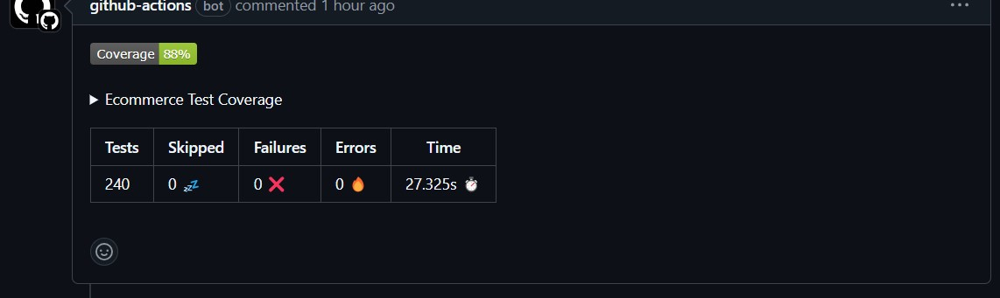

# E-commerce Platform

## Introduction

This is a comprehensive e-commerce platform built using Django Rest Framework (DRF) with a focus on enabling sellers to manage products, orders, and inventory. The platform follows the <a href="https://github.com/HackSoftware/Django-Styleguide">Hacksoft</a> architecture, where selectors are used for database retrieval and services handle business logic. The platform is fully dockerized with MySQL as the database, Redis as message broker, Celery, and Celery Beat for background tasks. It supports multiple functionalities such as user registration with JWT authentication, 2FA, product management, store management, and payment processing.

## Features

### I. Users

- **User Registration & Login:** Users can register as either sellers or customers.
- **2FA Login:** After login, users receive an OTP via email, which they must verify before accessing the system.
- **JWT-Based Authentication:** We use JWT tokens for secure authentication, including access tokens and OTP tokens.
- **Password Management:** Users can request a password reset link via email and also change their password when logged in.

### II. Profiles

- **Automatic Profile Creation:** User profiles are created automatically through Django signals.
- **Profile Management:** Users can view and update their profiles, which include additional information such as phone numbers and birth dates.

### III. Products

- **CRUD Operations:** Sellers can create, update, and delete their products. Admin users have additional permissions to manage all products.
- **Custom Permissions:** Only sellers or admins can manage products.

### IV. Stores

- **Multiple Store Support:** Sellers can manage multiple stores (branches), with one store set as the default for shipping purposes.

### V. Inventory

- **Inventory Management:** Each store tracks the stock for the products it offers. Sellers receive notifications when stock is low.

### VI. Cart & Wishlist

- **Cart Management:** Users can add items to their cart, update quantities, remove items, or clear the entire cart.
- **Wishlist Management:** Similar to cart functionality, users can add and manage wishlist items.

### VII. Reviews

- **Product Reviews:** Users can leave reviews for products they have purchased.

### VIII. Addresses

- **Multiple Addresses:** Users can store multiple addresses, set a default address, and manage their address book.

### IX. Payments

- **Payment Methods:** Users can manage their payment methods, including saving one as the default.
- **Order Payments:** Payment integration using Stripe with ngrok to handle webhooks from the local environment.

### X. Categories

- **Category Management:** Products are categorized for easier management. Only admins can manage categories.

### XI. Suppliers

- **Supplier Management:** Products are linked to suppliers, e.g., Samsung.

### XII. Discounts

- **Discount Codes:** Admins can create time-bound discount codes for users to apply at checkout.

### XIII. Orders

- **Order Management:** Users can place orders, track them, and view their order history. Payment is integrated using Stripe.

## Background Tasks

### Celery Tasks

- Periodically sends restock notifications to sellers when product inventory is low.
- Automatically settles orders after 14 days via periodic tasks.
- Celery Beat is used for scheduling periodic tasks.

## Admin Panel

The admin panel is customized for managing various entities, including users, products, stores, inventory, and more.

## Testing & Linting

- Comprehensive testing using pytest, covering all important functionality.
- Linting checks are performed using GitHub Actions.

## Docker Setup

The platform is fully Dockerized using Docker Compose. Services include:

- Django app
- MySQL database
- Redis for caching and background tasks
- Celery and Celery Beat for handling background tasks

To start the app, simply run:

```bash
docker-compose up
```

## CI/CD 'GitHub Actions'

- **Checks Workflow**: Triggered on every push to run linting checks and tests.

- **Pytest-Coverage Workflow**: Triggered on pull requests, it runs the tests and comments on the pull request with coverage percentage and test results.



## How to Use the Project

1. **Clone the Repository:**

   ```bash
   git clone https://github.com/AmrElkfrawy/ecommerce
   ```

2. **Run the Docker Compose Command:**

   ```bash
   docker-compose up
   ```

3. **Make Migrations:**

   ```bash
   docker-compose exec app python manage.py makemigrations
   docker-compose exec app python manage.py migrate
   ```

4. ** Run the Tests:**

   ```bash
   docker-compose exec app pytest
   ```

5. **Create a Superuser:**

   ```bash
   docker-compose exec app python manage.py createsuperuser
   ```

6. **Access the Admin Panel:**

   Visit `http://localhost:8000/admin/` and log in with the superuser credentials.

7. **API Documentation:**

- **Postman collection:** Postman collection available [here](https://documenter.getpostman.com/view/37981185/2sAXjJ7E1Z).
- **Swagger documentation:** Swagger documentation available at `http://localhost:8000/swagger/`.

The project is now ready for use!
